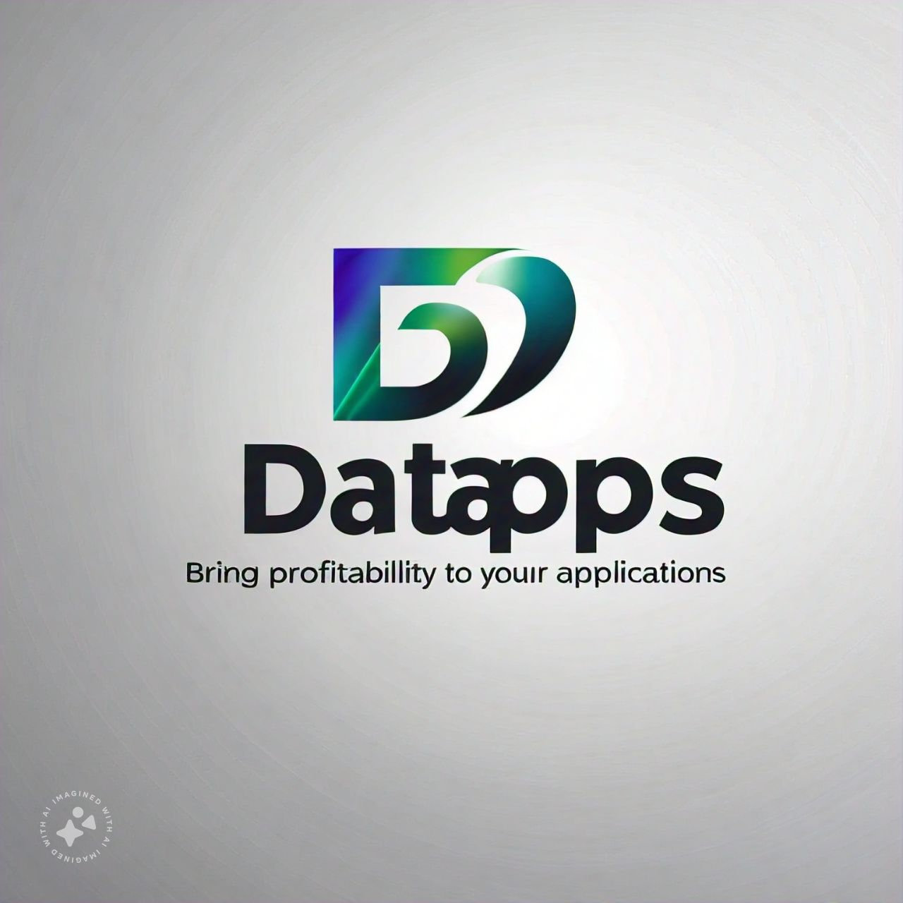

# Data Apps

## Introducción: 

Somos una empresa dedicada al análisis de mercado y la creación de modelos predictivos para la toma de decisiones en nuevos proyectos. Con el crecimiento exponencial de las aplicaciones móviles, la Google Play Store se ha convertido en un campo vasto y competitivo, donde destacar y asegurar el éxito de una aplicación es cada vez más desafiante. En este proyecto, nos enfocamos en proporcionar a nuestros clientes información valiosa y modelos predictivos que les permitan identificar las características más rentables y exitosas para sus aplicaciones.

## Contexto: La Google 

Play Store alberga millones de aplicaciones, lo que hace que decidir el tipo de aplicación y las características más rentables sea un desafío complejo. En un mercado tan saturado, comprender qué hace que una aplicación destaque en términos de calificación y descargas es crucial para desarrolladores y empresas que buscan maximizar su retorno de inversión. Este proyecto se enfoca en analizar este vasto ecosistema para ayudar en la toma de decisiones informadas sobre el desarrollo y lanzamiento de aplicaciones móviles.

## Descripción del Proyecto: 

El objetivo principal de este proyecto es realizar un análisis de mercado exhaustivo de las aplicaciones en la Google Play Store, con el fin de identificar las características que contribuyen a obtener la mejor calificación y el mayor número de descargas. Para lograrlo, se desarrollará una aplicación web que permitirá a los usuarios analizar las mejores características y tendencias del mercado. Además, se creará un modelo predictivo capaz de estimar la calificación de una aplicación y el número potencial de descargas, brindando así una herramienta poderosa para la planificación y optimización de nuevos desarrollos en el ámbito móvil.

Los datos fueron extraidos  de la siguiente página: 
    - https://www.kaggle.com/datasets/gauthamp10/google-playstore-apps?resource=download

# Tecnologías usadas

El proyecto hace uso de diversas tecnologías y herramientas para realizar un análisis exhaustivo de los siniestros viales. Algunas de las principales tecnologías utilizadas fueron:

 

## Colaboradores:

**Erley Valeta**

**Micaela Callahuanca**

**Daniel Pequeño**

**Pao Cedano**

**Abner Galan**

**Facundo Blanco**

